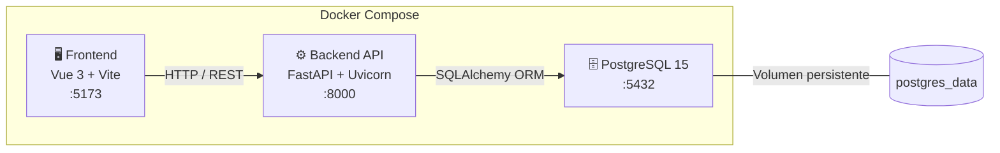
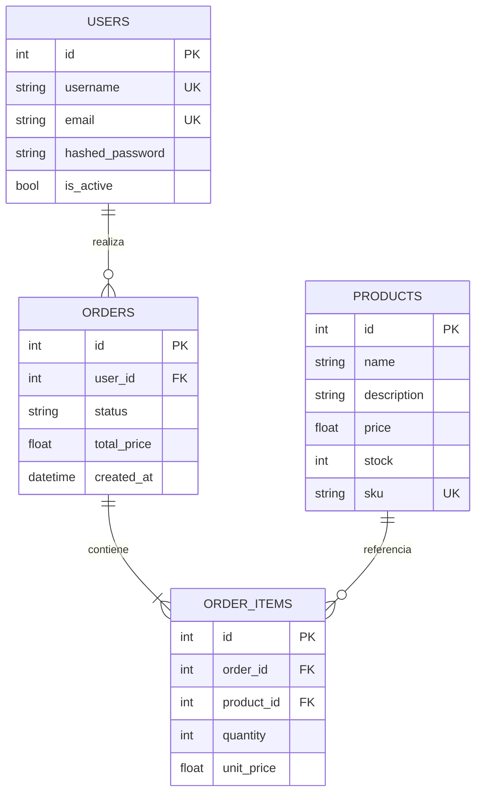

# Sistema de Gestión de Inventario y Pedidos


## Descripción

Aplicación fullstack para la gestión de inventario y procesamiento de pedidos empresariales, desarrollada durante el periodo de prácticas en **Libnamic**. El sistema replica la lógica de negocio de un ERP moderno: gestión de productos con control de stock, creación de pedidos con validación automática de disponibilidad, y autenticación mediante tokens JWT.

El proyecto está completamente contenerizado con Docker Compose, lo que permite levantar los tres servicios (base de datos, API y frontend) con un solo comando.

## Arquitectura del Sistema



## Stack Tecnológico

| Capa | Tecnología | Propósito |
|------|-----------|-----------|
| **Frontend** | Vue 3, Vite 7, Pinia, Vue Router | SPA con gestión de estado y enrutamiento |
| **Backend** | FastAPI, Uvicorn | API REST asíncrona y autodocumentada |
| **ORM** | SQLAlchemy | Mapeo objeto-relacional |
| **Validación** | Pydantic | Esquemas de datos y tipado fuerte |
| **Base de Datos** | PostgreSQL 15 | Persistencia relacional |
| **Migraciones** | Alembic | Versionado del esquema de la BD |
| **Seguridad** | OAuth2 + JWT, Bcrypt | Autenticación y hashing de contraseñas |
| **Infraestructura** | Docker, Docker Compose | Contenedorización y orquestación |

## Estructura del Proyecto

```
backend_libnamic/
├── docker-compose.yml          # Orquestación de los 3 servicios
├── backend/
│   ├── Dockerfile              # Imagen Python 3.11-slim
│   ├── requirements.txt        # Dependencias del backend
│   ├── alembic.ini             # Configuración de Alembic
│   ├── alembic/
│   │   └── versions/           # Historial de migraciones
│   └── app/
│       ├── main.py             # Endpoints y configuración CORS
│       ├── models.py           # Entidades SQLAlchemy (4 tablas)
│       ├── schemas.py          # DTOs Pydantic (request/response)
│       ├── crud.py             # Lógica de negocio y acceso a datos
│       ├── database.py         # Conexión y sesión de PostgreSQL
│       └── security.py         # JWT y hashing con Bcrypt
└── frontend/
    ├── Dockerfile              # Imagen Node 20-slim
    ├── package.json            # Dependencias del frontend
    └── src/
        ├── views/
        │   ├── LoginView.vue   # Autenticación de usuario
        │   ├── ProductsView.vue# Catálogo y gestión de productos
        │   └── MyOrdersView.vue# Historial de pedidos del usuario
        ├── router/             # Enrutamiento SPA
        └── stores/             # Estado global (Pinia)
```

## Modelo de Datos



## Instalación y Despliegue

### Prerrequisitos

- [Docker Desktop](https://www.docker.com/products/docker-desktop/) instalado y en ejecución
- [Git](https://git-scm.com/)

### Levantar el entorno

```bash
# 1. Clonar el repositorio
git clone <url-del-repositorio>
cd backend_libnamic

# 2. Construir y arrancar los 3 contenedores
docker compose up --build

# 3. Verificar que todo funciona:
#    - API (Swagger):  http://localhost:8000/docs
#    - Frontend:       http://localhost:5173
```

### Detener el entorno

```bash
# Parar los contenedores (Ctrl+C en la terminal con logs, o bien):
docker compose down

# Para volver a arrancar (sin reconstruir):
docker compose up
```

> Los datos de la base de datos se mantienen entre reinicios gracias al volumen persistente `postgres_data`.

## Endpoints de la API

La documentación interactiva completa está disponible en **http://localhost:8000/docs** (Swagger UI).

### Autenticación

| Método | Ruta | Descripción | Auth |
|--------|------|-------------|------|
| `POST` | `/token` | Genera un token JWT de acceso | ❌ |
| `POST` | `/register` | Registra un nuevo usuario | ❌ |
| `GET` | `/users/me` | Valida el token actual | ✅ |

### Productos

| Método | Ruta | Descripción | Auth |
|--------|------|-------------|------|
| `GET` | `/products/` | Lista todos los productos (paginado) | ❌ |
| `GET` | `/products/{id}` | Detalle de un producto | ❌ |
| `POST` | `/products/` | Crea un producto (valida SKU único) | ✅ |

### Pedidos

| Método | Ruta | Descripción | Auth |
|--------|------|-------------|------|
| `POST` | `/orders/` | Crea un pedido (valida stock, resta inventario) | ✅ |
| `GET` | `/orders/my-orders` | Lista los pedidos del usuario autenticado | ✅ |

### Flujo de autenticación en Swagger

1. Hacer clic en el botón **Authorize** 🔒
2. Introducir credenciales (usuario y contraseña)
3. El token JWT generado se incluirá automáticamente en las peticiones protegidas
4. El token expira a los **30 minutos**

## Frontend

La aplicación Vue 3 ofrece tres vistas principales:

- **Login** (`/login`) — Formulario de autenticación que obtiene el token JWT
- **Productos** (`/products`) — Catálogo de productos con gestión de inventario
- **Mis Pedidos** (`/my-orders`) — Historial de pedidos realizados por el usuario

## Migraciones de Base de Datos (Alembic)

El esquema de la base de datos se gestiona mediante **Alembic**, lo que permite evolucionar las tablas sin perder datos existentes.

```bash
# Ver el historial de migraciones
docker compose exec web alembic history

# Aplicar todas las migraciones pendientes
docker compose exec web alembic upgrade head

# Crear una nueva migración tras modificar models.py
docker compose exec web alembic revision --autogenerate -m "descripcion del cambio"
```

### Historial de migraciones

1. `38c00a3fe111` — Inicialización de tablas `users` y `products`
2. `896bade5855d` — Creación de tabla `orders`
3. `b1b55b4582bc` — Creación de tabla `order_items` con relaciones

---

**Desarrollado por:** Sergio Estudillo Marabot · Prácticas en [Libnamic](https://libnamic.com)
