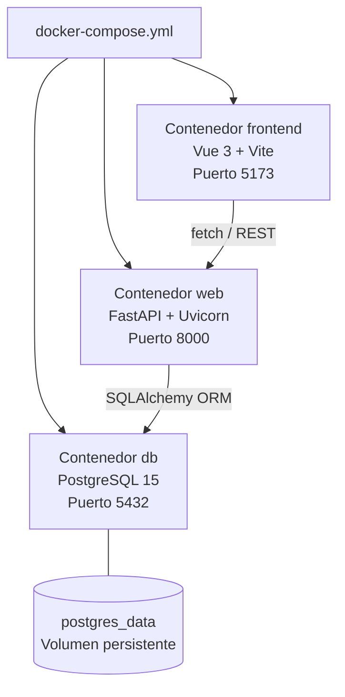
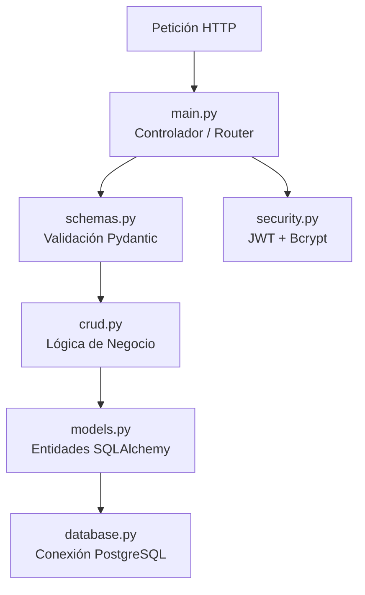
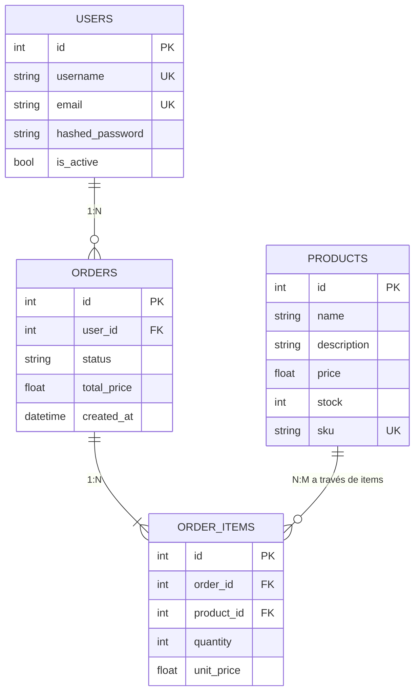
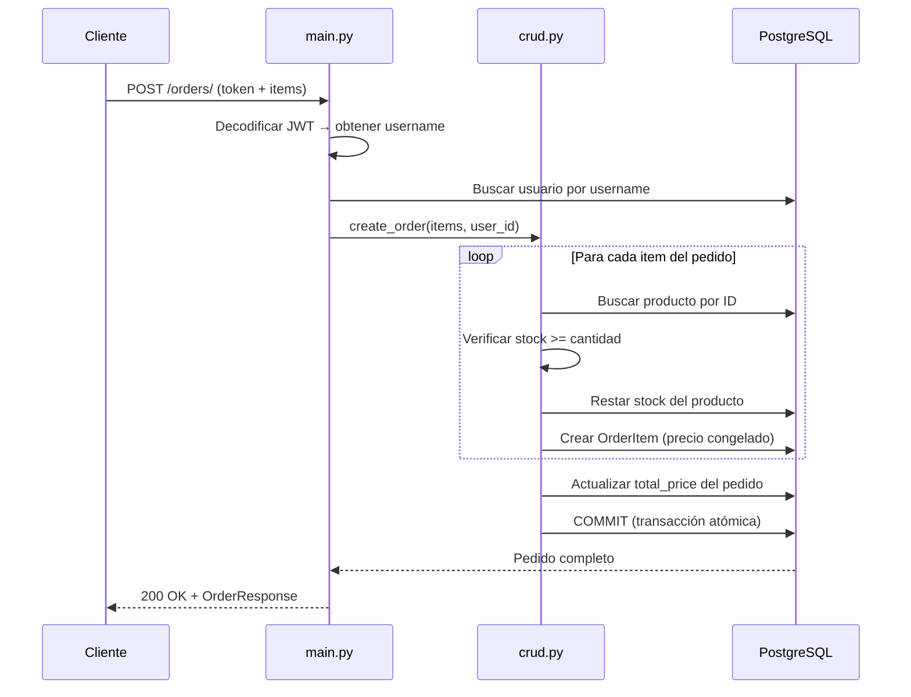
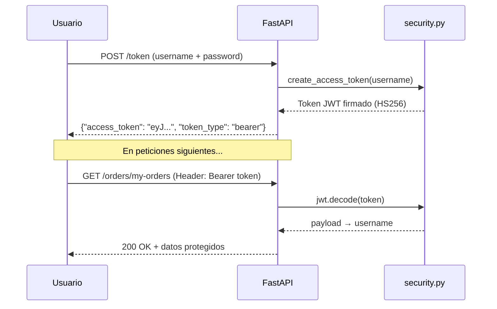

# Documentación Técnica — Sistema de Gestión de Inventario

Documento de referencia personal sobre la arquitectura, decisiones de diseño y funcionamiento interno del proyecto.

---

## 1. Infraestructura: Docker y PostgreSQL

El proyecto no se ejecuta directamente sobre el sistema operativo local, sino dentro de **contenedores Docker aislados**, lo que garantiza un entorno reproducible en cualquier máquina.

### Servicios orquestados por Docker Compose



| Contenedor | Función | Detalle |
|-----------|---------|---------|
| `db` | Base de datos relacional | PostgreSQL 15 con volumen persistente `postgres_data` — los datos sobreviven a reinicios |
| `web` | API REST | Python 3.11 ejecutando FastAPI. Se conecta a la BD mediante la URL interna `postgresql://user:pass@db/inventario_db` |
| `frontend` | Interfaz de usuario | Node 20 con Vite en modo desarrollo. Consume la API del contenedor `web` |

**Puntos de acceso:**
- **Swagger UI (API):** `http://localhost:8000/docs`
- **Aplicación Vue:** `http://localhost:5173`

---

## 2. Arquitectura del Backend: Separación por Capas

El código sigue el patrón de **Capas de Responsabilidad** (Layered Architecture), donde cada módulo tiene un propósito bien definido:



### Descripción de cada módulo

| Archivo | Capa | Responsabilidad |
|---------|------|----------------|
| `database.py` | Infraestructura | Configura el engine de SQLAlchemy, la SessionLocal y el generador `get_db()` que inyecta la sesión en cada endpoint |
| `models.py` | Dominio | Define las 4 tablas del sistema: `users`, `products`, `orders` y `order_items`, con sus relaciones (`relationship`) |
| `schemas.py` | Contrato (DTO) | Esquemas Pydantic que definen qué datos acepta y devuelve la API. Ejemplo: `UserCreate` acepta password, pero `User` (respuesta) nunca la expone |
| `crud.py` | Negocio | Contiene la lógica principal: consultas, creación de productos y el flujo completo de pedidos (verificación de stock, cálculo de precios, resta de inventario) |
| `security.py` | Transversal | Generación y verificación de tokens JWT (HS256, expiración 30 min) y hashing de contraseñas con Bcrypt |
| `main.py` | Presentación | Define los endpoints REST, aplica middleware CORS y gestiona la inyección de dependencias (sesión de BD + token OAuth2) |

---

## 3. Modelo de Datos

Las relaciones entre tablas siguen el patrón maestro-detalle habitual en sistemas de pedidos:



**Decisión de diseño:** `unit_price` se guarda en `order_items` en el momento de la compra para "congelar" el precio. Si el producto cambia de precio después, los pedidos anteriores mantienen el valor original.

---

## 4. Flujo del Sistema de Pedidos

Este es el proceso más complejo del backend. Cuando un usuario crea un pedido, ocurre lo siguiente:



**Puntos de integridad:**
- Si el stock es insuficiente para cualquier item, se lanza un error HTTP 400 y no se procesa nada
- El precio total se calcula sumando `precio_unitario × cantidad` de cada item
- Toda la operación se ejecuta dentro de una transacción de base de datos

---

## 5. Sistema de Seguridad: JWT y OAuth2

### Flujo de autenticación



- **Algoritmo:** HS256 (HMAC con SHA-256)
- **Expiración:** 30 minutos
- **Hashing de contraseñas:** Bcrypt mediante `passlib`
- **Esquema OAuth2:** Password Flow con `OAuth2PasswordBearer`

---

## 6. Control de Versiones del Esquema: Alembic

En lugar de recrear la base de datos cuando se modifica el modelo, se utiliza **Alembic** para gestionar migraciones incrementales (similar a un historial de Git para las tablas).

### Historial de migraciones del proyecto

| Revisión | Descripción |
|----------|-------------|
| `38c00a3fe111` | Inicialización de tablas `users` y `products` |
| `896bade5855d` | Creación de tabla `orders` |
| `b1b55b4582bc` | Creación de tabla `order_items` con relaciones FK |

### Comandos útiles

```bash
# Ver historial completo
docker compose exec web alembic history

# Aplicar migraciones pendientes
docker compose exec web alembic upgrade head

# Generar nueva migración automática
docker compose exec web alembic revision --autogenerate -m "descripcion"
```

---

## 7. Frontend: Vue 3 + Vite

La interfaz está construida con **Vue 3** (Composition API), **Pinia** para gestión de estado y **Vue Router** para navegación SPA.

### Vistas implementadas

| Ruta | Vista | Funcionalidad |
|------|-------|--------------|
| `/login` | `LoginView.vue` | Formulario de login que solicita el token JWT a `/token` |
| `/products` | `ProductsView.vue` | Catálogo de productos con posibilidad de crear nuevos (requiere auth) |
| `/my-orders` | `MyOrdersView.vue` | Historial de pedidos del usuario autenticado |

La ruta raíz (`/`) redirige automáticamente a `/login`.

---

## 8. Comandos de Operación

| Acción | Comando |
|--------|---------|
| Arrancar todo (primera vez o tras cambios) | `docker compose up --build` |
| Arrancar todo (sin reconstruir) | `docker compose up` |
| Detener contenedores | `Ctrl+C` en la terminal con logs |
| Parar y eliminar contenedores (datos intactos) | `docker compose down` |
| Parar y eliminar **todo** (incluidos datos) | `docker compose down -v` |

---

## 9. Decisiones de Diseño Destacables

1. **Separación en capas** — Models, Schemas y CRUD están aislados para que el código sea mantenible y extensible. Añadir una nueva entidad sigue siempre el mismo patrón: modelo → esquema → CRUD → endpoint.

2. **Integridad transaccional** — El sistema de pedidos verifica el stock y utiliza transacciones de base de datos para garantizar que los datos siempre sean consistentes. No hay posibilidad de vender un producto sin stock.

3. **Portabilidad total** — Gracias a Docker Compose, los tres servicios se despliegan en cualquier máquina con un solo comando (`docker compose up`), con la garantía de que el entorno será idéntico al de desarrollo.

4. **Migraciones controladas** — Alembic permite evolucionar el esquema de la BD de forma segura y trazable, sin perder datos existentes. Cada cambio queda registrado como una "versión" reversible.

5. **Precio congelado en pedidos** — Al guardar `unit_price` en cada `OrderItem`, los pedidos históricos son inmutables ante cambios futuros de precio en el catálogo.

---

**Autor:** Sergio Estudillo Marabot
